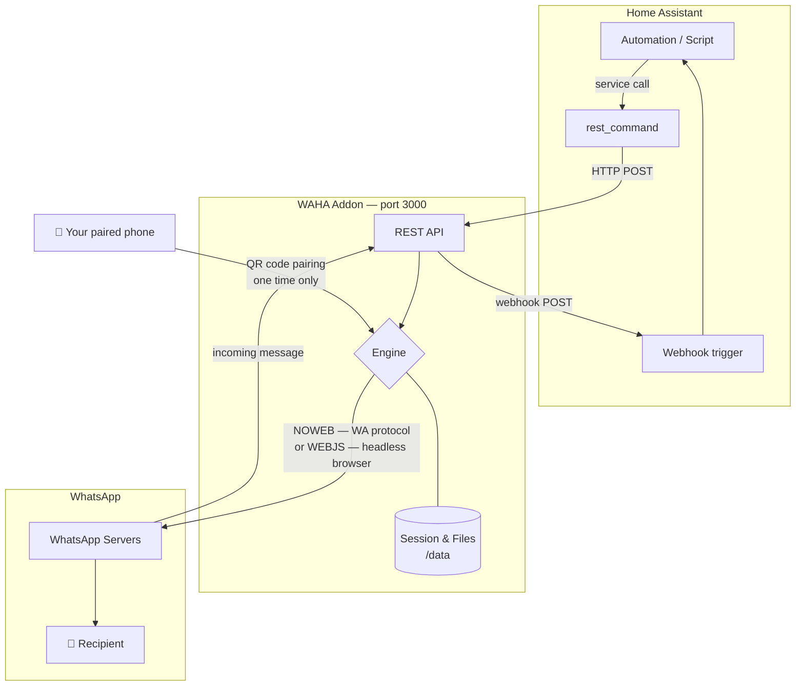

# WAHA WhatsApp — Home Assistant Addon

Send WhatsApp **messages, images, videos, and files** directly from Home Assistant automations using [WAHA](https://waha.devlike.pro/) (WhatsApp HTTP API).

---

## Architecture



**Outbound flow** (HA → WhatsApp):
`Automation` → `rest_command` → `WAHA API :3000` → `WhatsApp servers` → `📱 recipient`

**Inbound flow** (WhatsApp → HA, optional):
`📱 sender` → `WhatsApp servers` → `WAHA webhook` → `HA webhook trigger` → `Automation`

---

## Engines

| Engine | Description | Resource usage | ARM support |
|--------|-------------|----------------|-------------|
| **NOWEB** ✅ | Direct WhatsApp multi-device protocol, no browser | ~100 MB RAM | Yes |
| **WEBJS** | WhatsApp Web inside headless Chromium | ~500 MB RAM | Limited |

NOWEB is recommended for most setups (NAS, Raspberry Pi, low-power devices).

---

## Installation

### Requirements by HA installation type

| HA Installation | Addon supported | Method |
|---|---|---|
| **Home Assistant OS** | ✅ | Add-on Store (this guide) |
| **Home Assistant Supervised** | ✅ | Add-on Store (this guide) |
| **Home Assistant Container** | ❌ | Use [docker-compose](#docker-compose-standalone) |
| **Home Assistant Core** | ❌ | Use [docker-compose](#docker-compose-standalone) |

### Add-on Store (HAOS / Supervised)

1. Go to **Settings → Add-ons → Add-on Store**
2. Click **⋮** (top-right) → **Repositories**
3. Add: `https://github.com/appslab-it/waha-addon`
4. Find **WAHA WhatsApp** in the store → **Install**
5. Configure the options (see below) → **Start**

> The first install downloads the WAHA image (~500 MB). This can take several minutes.

### Docker Compose (standalone)

For **HA Container** or **HA Core**, run WAHA alongside Home Assistant:

```yaml
# docker-compose.yml
services:
  waha:
    image: devlikeapro/waha:latest
    container_name: waha-whatsapp
    ports:
      - "3000:3000"
    environment:
      WHATSAPP_API_KEY: "changeme"
      WHATSAPP_DEFAULT_ENGINE: "NOWEB"
    volumes:
      - waha_sessions:/app/sessions
      - waha_files:/app/files
    restart: unless-stopped

volumes:
  waha_sessions:
  waha_files:
```

Then point your `rest_command` URLs to `http://<host-ip>:3000` instead of `localhost`.

---

## Configuration Options

| Option | Type | Default | Description |
|--------|------|---------|-------------|
| `api_key` | string | `changeme` | Secret key to authenticate API requests. Change this. |
| `session_name` | string | `default` | WhatsApp session identifier |
| `engine` | enum | `NOWEB` | `NOWEB` (recommended) or `WEBJS` |
| `webhook_url` | string | _(empty)_ | URL to receive incoming WhatsApp events (e.g. `http://homeassistant.local:8123/api/webhook/whatsapp`) |
| `webhook_events` | string | `message,session.status` | Comma-separated events to forward to the webhook |
| `log_level` | enum | `INFO` | `INFO`, `DEBUG`, `WARN`, `ERROR` |

---

## Pairing Your WhatsApp Account

1. Start the addon
2. Open the WAHA dashboard: **`http://<ha-ip>:3000`**
3. Navigate to **Sessions** → click your session → **QR Code**
4. Scan the QR code with WhatsApp on your phone (**Linked Devices → Link a device**)
5. Status changes to `WORKING` — you're ready

Session data is persisted across restarts. You only need to scan the QR code once.

---

## Home Assistant Integration

### REST Commands

Add to `configuration.yaml`:

```yaml
rest_command:
  whatsapp_send_message:
    url: "http://localhost:3000/api/default/sendText"
    method: POST
    headers:
      X-Api-Key: "your_api_key"
      Content-Type: "application/json"
    payload: '{"chatId": "{{ phone }}@c.us", "text": "{{ message }}"}'

  whatsapp_send_image:
    url: "http://localhost:3000/api/default/sendImage"
    method: POST
    headers:
      X-Api-Key: "your_api_key"
      Content-Type: "application/json"
    payload: '{"chatId": "{{ phone }}@c.us", "caption": "{{ caption }}", "file": {"url": "{{ url }}"}}'

  whatsapp_send_video:
    url: "http://localhost:3000/api/default/sendVideo"
    method: POST
    headers:
      X-Api-Key: "your_api_key"
      Content-Type: "application/json"
    payload: '{"chatId": "{{ phone }}@c.us", "caption": "{{ caption }}", "file": {"url": "{{ url }}"}}'

  whatsapp_send_file:
    url: "http://localhost:3000/api/default/sendFile"
    method: POST
    headers:
      X-Api-Key: "your_api_key"
      Content-Type: "application/json"
    payload: '{"chatId": "{{ phone }}@c.us", "caption": "{{ caption }}", "file": {"url": "{{ url }}"}}'
```

Replace `default` with your `session_name` if you changed it.
Replace `localhost` with the host IP if running HA Container/Core.

### Phone Number Format

Use international format without `+` and without spaces:
- 🇮🇹 Italy: `393331234567` (country code `39` + number without leading `0`)
- 🇺🇸 USA: `12125551234`

### Automation Examples

**Send a message when a door opens:**
```yaml
automation:
  trigger:
    platform: state
    entity_id: binary_sensor.front_door
    to: "on"
  action:
    service: rest_command.whatsapp_send_message
    data:
      phone: "393331234567"
      message: "Front door opened at {{ now().strftime('%H:%M') }}"
```

**Send a camera snapshot on motion:**
```yaml
automation:
  trigger:
    platform: state
    entity_id: binary_sensor.camera_motion
    to: "on"
  action:
    - service: camera.snapshot
      target:
        entity_id: camera.entrance
      data:
        filename: "/config/www/snapshot.jpg"
    - delay: "00:00:02"
    - service: rest_command.whatsapp_send_image
      data:
        phone: "393331234567"
        caption: "Motion detected at {{ now().strftime('%H:%M') }}"
        url: "http://homeassistant.local:8123/local/snapshot.jpg"
```

**Send to multiple numbers:**
```yaml
action:
  repeat:
    for_each: ["393331234567", "393339876543"]
    sequence:
      - service: rest_command.whatsapp_send_message
        data:
          phone: "{{ repeat.item }}"
          message: "Alert: something happened!"
```

More examples in [ha-examples/](ha-examples/).

---

## API Documentation

The full WAHA REST API (Swagger UI) is available at:
```
http://<ha-ip>:3000/api
```

---

## Supported Architectures

| Architecture | Devices |
|---|---|
| `amd64` | Synology DS218+, Intel NUC, most x86_64 machines |
| `aarch64` | Raspberry Pi 4/5, Synology DS923+ |

---

## Troubleshooting

| Problem | Solution |
|---|---|
| QR code not appearing | Check addon logs, restart the addon |
| Session disconnects | Re-scan QR code; consider using NOWEB engine |
| Messages not sending | Verify `api_key` matches in options and `rest_command` |
| Port 3000 already in use | Change the port mapping in addon options |
| Build takes too long | Normal — first download of WAHA image is ~500 MB |

---

## License

MIT — see [LICENSE](LICENSE)
